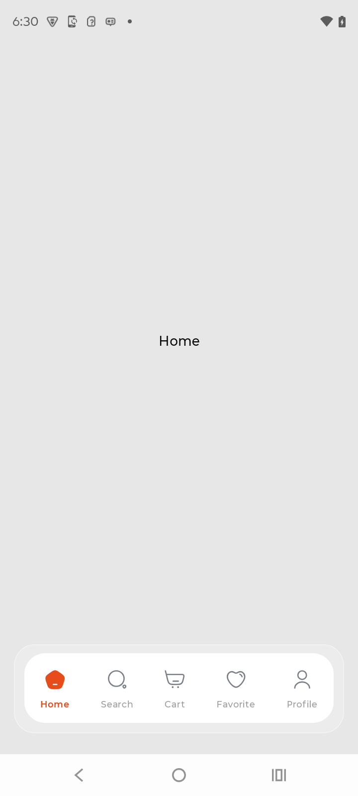

# Compose Bottom Bar

A beautiful, custom bottom navigation bar implementation using Jetpack Compose. This project demonstrates how to create a modern, floating-style navigation bar with custom shapes, glow effects, and state-dependent SVG icons.

## Features

- **Custom Shape & Design**: A unique floating navigation bar with rounded corners and a subtle glow/border effect.
- **State-based SVG Icons**: Seamless switching between active and inactive SVG icons.
- **Dynamic Theming**: Matches the specific color palette (Orange/Gray) and typography styles.
- **Jetpack Compose**: Built entirely using modern Android declarative UI.

## Demo



## Implementation Details

The core logic is located in `CustomBottomNavigation.kt`. It uses a nested `Box` structure:
1.  **Outer Layer**: Provides the semi-transparent background and border for the "floating" effect.
2.  **Inner Layer**: A white `Row` that contains the navigation items.
3.  **Navigation Items**: `CustomBottomNavItem` handles the icon swapping (`painterResource`) and label styling based on the `isSelected` state.

```kotlin
@Composable
fun CustomBottomNavigation(
    selectedItem: Int,
    onItemSelected: (Int) -> Unit
) {
    // ... items definition ...
    
    Box(
        modifier = Modifier
            .fillMaxWidth()
            .navigationBarsPadding()
            .padding(bottom = 24.dp, start = 16.dp, end = 16.dp),
        contentAlignment = Alignment.BottomCenter
    ) {
        // Outer glow layer
        // Main white bar Row
    }
}
```

## Setup

1.  Clone the repository.
2.  Open in Android Studio (Ladybug or newer recommended).
3.  Sync Gradle and run the `:app` module.

## License

```
Copyright 2024 Compose Bottom Bar Contributors
```
